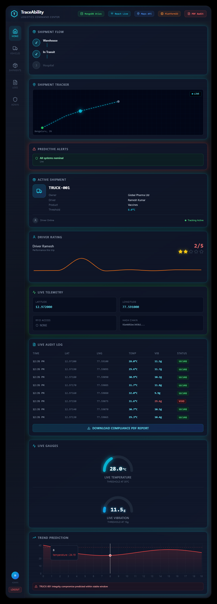
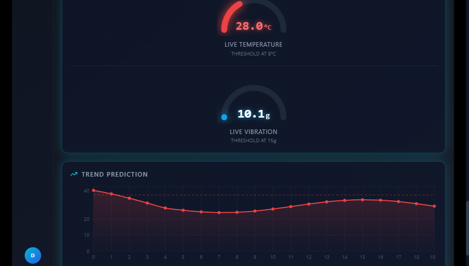

# TraceVigil AI

> **Smart Logistics & Cargo Safety System** — real-time shipment monitoring with ESP32 hardware, SHA-256 tamper-proof audit trails, and role-based React dashboards.



---

## Overview

TraceVigil AI is an end-to-end IoT logistics platform. An **ESP32 microcontroller** collects live sensor telemetry (impact, temperature, humidity, GPS location, and RFID access events), signs each packet using **SHA-256 hash chaining**, and forwards the data over WiFi to a **Node.js/MongoDB backend**. A **React frontend** provides separate administrator and driver dashboard views with real-time charts, audit logs, damage-hotspot detection, and one-click PDF compliance export.

> **Honest scope note:** The spoilage warning uses a temperature-threshold heuristic on the last five readings. There is no trained machine-learning model in this repository.

---

## Features

| Category | What is implemented |
|---|---|
| **Hardware** | ESP32 firmware reading MPU6050 (impact), DHT22 (temp/humidity), Neo-6M GPS, RC522 RFID, and Buzzer |
| **Tamper detection** | SHA-256 hash chaining: each packet's hash depends on the previous; backend recalculates and stores a `tampered` flag |
| **Spoilage prediction** | Rolling average of last 5 temperature readings; warns when estimated time-to-spoilage drops below 60 minutes |
| **RFID access control** | Allowlisted RFID UIDs trigger `GRANTED`; all others trigger `DENIED` alert |
| **Offline resilience** | SPIFFS flash storage on ESP32; queued packets sync automatically when WiFi reconnects |
| **Backend API** | Express REST API with JWT auth, bcrypt passwords, MongoDB storage, email alerts via Nodemailer |
| **Damage hotspots** | Aggregates damage events per route segment; segments with ≥ 3 events are flagged as hotspots |
| **Admin dashboard** | Live telemetry gauges, temperature/impact trend charts, audit log table, hotspot panel, PDF export |
| **Driver dashboard** | Read-only mobile view: truck ID, GPS location, status, RFID access, last-updated time |
| **Serial bridge** | Python script forwards ESP32 `[Packet] <json>` lines to the backend for USB-tethered setups |
| **Test suite** | `unittest` tests for the serial bridge parser |

---

## Project Structure

```text
TraceVigil AI/
├── backend/
│   ├── middleware/
│   │   └── auth.js               JWT role middleware
│   ├── models/
│   │   ├── damageEvent.js        MongoDB schema – damage events
│   │   ├── tracepacket.js        MongoDB schema – sensor packets
│   │   └── user.js               MongoDB schema – user accounts
│   ├── utils/
│   │   └── sendAlert.js          Optional Nodemailer email alerts
│   ├── .env.example              Environment variable template
│   ├── package.json
│   ├── seed-dummy.js             Demo data seeder (dev only)
│   └── server.js                 Express API server
├── docs/
│   ├── assets/                   Project screenshots
│   ├── SEMINAR_GUIDE.md          Architecture and presentation guide
│   └── START.md                  Step-by-step setup and wiring guide
├── firmware/
│   ├── arduino/
│   │   └── traceability.ino      Arduino IDE sketch (canonical firmware)
│   └── platformio/
│       ├── platformio.ini        PlatformIO build configuration
│       └── src/main.cpp          PlatformIO source (mirrors .ino)
├── frontend/
│   ├── src/
│   │   ├── AdminDashboard.jsx    Full admin control-center UI
│   │   ├── DriverDashboard.jsx   Limited driver mobile view
│   │   ├── api.js                API base URL and auth helpers
│   │   ├── app.jsx               Root component and role-based routing
│   │   ├── index.css             Tailwind base + custom animations
│   │   ├── loginpage.jsx         Login / register screen
│   │   └── main.jsx              React entry point
│   ├── index.html
│   ├── package.json
│   ├── postcss.config.cjs
│   ├── tailwind.config.js
│   └── vite.config.js
├── tests/
│   └── test_serial_bridge.py     Serial bridge unit tests
├── tools/
│   ├── requirements.txt          Python dependencies
│   └── serial_bridge.py          USB-serial to HTTP bridge
├── .gitignore
└── README.md
```

---

## Technology Stack

| Layer | Technologies |
|---|---|
| **Firmware** | ESP32, Arduino C++, PlatformIO, Adafruit MPU6050, DHT, TinyGPS++, MFRC522, mbedTLS SHA-256, SPIFFS |
| **Backend** | Node.js, Express, MongoDB, Mongoose, JWT, bcrypt, Nodemailer |
| **Frontend** | React 18, Vite, Tailwind CSS, Recharts, jsPDF, Lucide React |
| **Tooling** | Python 3, pyserial, requests, unittest |

---

## Screenshots

| Admin Dashboard | Driver View |
|---|---|
|  |  |

---

## Prerequisites

- **Node.js** (LTS) + npm
- **MongoDB Community Server** running locally or a remote URI
- **Python 3** (for the serial bridge)
- **Arduino IDE** with the ESP32 board package, or **PlatformIO**

---

## Backend Setup

```powershell
cd backend
npm install
copy .env.example .env
```

Edit `backend/.env` and set at minimum:

```env
MONGODB_URI=mongodb://127.0.0.1:27017/traceability
JWT_SECRET=<a-long-random-secret>
```

Start MongoDB, then:

```powershell
npm start
# → TraceVigil AI backend running on http://localhost:5000
```

### Optional: seed demo data

```powershell
npm run seed   # clears and re-seeds TracePacket + DamageEvent collections
```

---

## Frontend Setup

```powershell
cd frontend
npm install
npm run dev
# → http://localhost:5173
```

The frontend targets `http://localhost:5000` by default. To open it from another device on the same network, edit `frontend/src/api.js`:

```js
export const API_BASE = "http://192.168.x.x:5000";  // your machine's LAN IP
```

---

## Firmware

### Arduino IDE

1. Open `firmware/arduino/traceability.ino`
2. Install the libraries listed at the top of the sketch via **Sketch → Include Library → Manage Libraries**
3. Set board to **ESP32 Dev Module**, select the correct port, and choose the **Default 4MB with spiffs** partition scheme
4. Replace the placeholder WiFi credentials and `SERVER_URL` with your values, then upload

### PlatformIO

```powershell
cd firmware/platformio
pio run --target upload
```

Required libraries and board settings are declared in `platformio.ini`.

---

## Serial Bridge (USB-tethered setup)

If you cannot flash WiFi credentials to the ESP32, use the Python serial bridge to forward packets from a USB connection:

```powershell
pip install -r tools/requirements.txt
python tools/serial_bridge.py
```

Override defaults with environment variables:

```powershell
$env:SERIAL_PORT = "COM4"
$env:BACKEND_URL = "http://192.168.1.5:5000/api/trace"
python tools/serial_bridge.py
```

---

## Environment Variables

All secrets are read from `backend/.env` (never committed).

| Variable | Purpose |
|---|---|
| `PORT` | Express listen port (default `5000`) |
| `MONGODB_URI` | MongoDB connection URI |
| `JWT_SECRET` | Signing secret for JWT tokens |
| `ALERT_EMAIL_ENABLED` | Set to `true` to enable email alerts |
| `ALERT_EMAIL_FROM` | Gmail sender address |
| `ALERT_EMAIL_PASSWORD` | Gmail app password |
| `ALERT_EMAIL_TO` | Alert recipient address |

---

## Hardware Wiring (ESP32)

| Sensor | Pin(s) |
|---|---|
| MPU6050 | SDA → GPIO21, SCL → GPIO22 |
| DHT22 | DATA → GPIO4 |
| GPS Neo-6M | TX → GPIO16, RX → GPIO17 |
| RC522 RFID | SS → GPIO5, SCK → GPIO18, MOSI → GPIO23, MISO → GPIO19, RST → GPIO27 |
| Buzzer | + → GPIO25 |

Full wiring diagrams and troubleshooting are in [`docs/START.md`](docs/START.md).

---

## Validation

After installing all dependencies:

```powershell
# Backend syntax check
npm run check --prefix backend

# Frontend production build
npm run build --prefix frontend

# Python unit tests
python -m unittest discover -s tests -v
```

---

## Documentation

- [`docs/START.md`](docs/START.md) — beginner setup, hardware wiring, troubleshooting checklist
- [`docs/SEMINAR_GUIDE.md`](docs/SEMINAR_GUIDE.md) — architecture deep-dive and presentation guide

---

## Security Notes

- **Never commit** `backend/.env`, WiFi credentials, JWT secrets, or email passwords.
- The firmware packet ingestion endpoint (`POST /api/trace`) has no device-level authentication. Do not expose it directly to an untrusted network without an additional authentication layer.
- User registration currently trusts the `role` field sent by the client. Restrict admin account creation before any public deployment.

---

## License

This project is released for educational and demonstration purposes.
